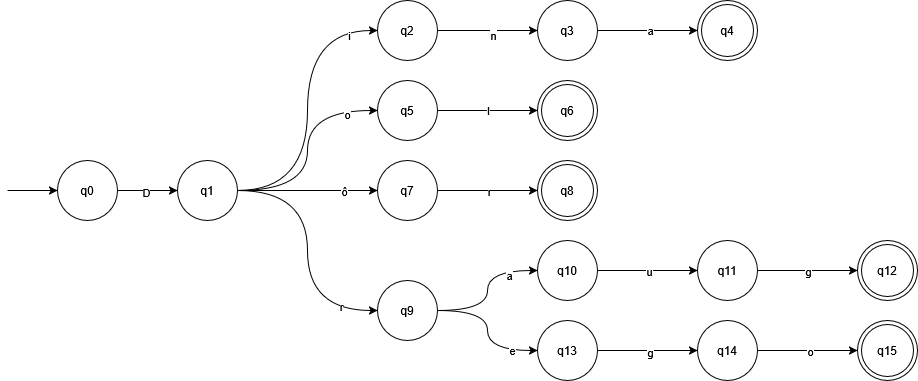
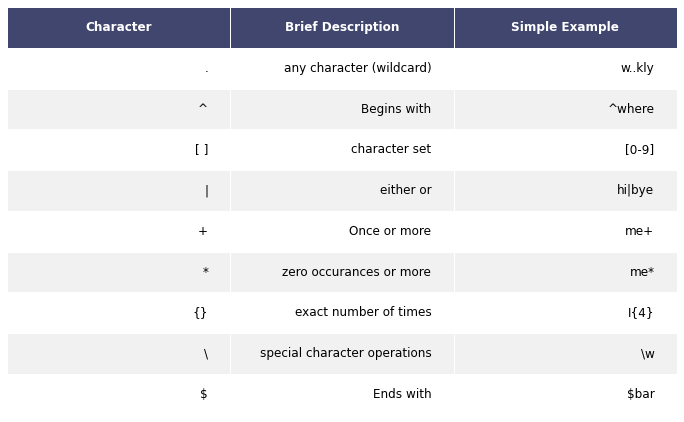

# Evidence: Implementation of Lexical Analysis  
## Formal Languages and Automata

**Author:** Alexis Yaocalli Berthou Haas 
**Course:** TC2037
**Date:** 22/03/2026

---

# 1. Introduction

Lexical analysis is the process of reading an input string and determining whether it belongs to a language defined by a set of formal rules. For computational theory, this process is fundamental in compilers and interpreters because it allows a program to identify valid tokens before moving to later stages such as syntax analysis (Aho, Lam, Sethi, & Ullman, 2007).

From the perspective of formal language theory, lexical analysis is closely related to **regular languages**, since these can be represented by **deterministic finite automata** and **regular expressions** (Hopcroft, Motwani, & Ullman, 2007). This relationship is important because it shows that the same language can be described in more than one formal way while preserving exactly the same set of accepted strings. In other words, a regular expression and a deterministic finite automaton may look different, but they can define the same language.

The purpose of this project is to design a lexical analyzer for a small fictional language composed of five elven words from the book series "The Lord of the Rings" by J.R.R. Tolkien.

- `Dina`
- `Dol`
- `Dôr`
- `Draug`
- `Drego`

The project does not attempt to model an entire natural or fictional language. Instead, it studies a **finite set of valid strings** and shows how such a set can be modeled formally and implemented computationally. This makes the problem suitable for lexical analysis, since every finite language is regular and therefore can be recognized by a deterministic finite automaton and described by an equivalent regular expression (Hopcroft et al., 2007; Sipser, 2012).

This paper presents the formal definition of the language, the construction of a deterministic finite automaton, the equivalent regular expression, the implementation of the automaton in Prolog, the implementation of the regular expression in Python, a test set for validation, and a complexity analysis comparing the two approaches.

---

# 2. Formal Definition of the Language

The language selected for this project is the finite language:

$$
L = \{\text{Dina}, \text{Dol}, \text{Dôr}, \text{Draug}, \text{Drego}\}
$$

This means that the language contains **exactly five strings**, and no other string belongs to it.

In formal language theory, a language is defined over an alphabet. The alphabet is the set of symbols from which the strings of the language are built. Since the five words in this project are composed only of the symbols shown below, the alphabet of the language is

$$
\Sigma = \{D, i, n, a, o, l, ô, r, u, g, e\}
$$

It is important to define the alphabet explicitly because every string in the language must belong to the set of all finite strings over that alphabet, written as

$$
L \subseteq \Sigma^*
$$

where $\Sigma^*$ denotes the set of all finite strings that can be formed using the symbols of $\Sigma$ (Hopcroft et al., 2007).

Since the language contains a finite number of strings, it is a **finite language**. A standard result in automata theory states that every finite language is regular. Therefore, because $L$ is regular, it can be recognized by a deterministic finite automaton and also described by a regular expression (Hopcroft et al., 2007; Sipser, 2012). This is the theoretical foundation that justifies the two models used in this work.

---

# 3. Deterministic Finite Automaton

## 3.1 Formal Definition

A deterministic finite automaton, usually abbreviated as **DFA**, is a mathematical model used to recognize regular languages. Formally, a DFA is defined as the 5-tuple

$$
M = (Q, \Sigma, \delta, q_0, F)
$$

where:

- $Q$ is a finite set of states
- $\Sigma$ is the input alphabet
- $\delta$ is the transition function
- $q_0 \in Q$ is the initial state
- $F \subseteq Q$ is the set of accepting states

The transition function has type

$$
\sigma(q, a) = p\
$$

where:

- $q \in Q$ is the current state
- $a \in \Sigma$ is the input symbol
- $p \in Q$ is the next state

This means that if the automaton is in a state $q \in Q$ and reads a symbol $a \in \Sigma$, the function $\sigma$ determines exactly one next state. The word *deterministic* means that there is never more than one possible transition for the same state and input symbol pair (Hopcroft et al., 2007).

In simpler terms, a DFA reads an input string from left to right, one symbol at a time. At each step, it changes state according to the transition function. If, after consuming the whole string, it ends in an accepting state, then the input belongs to the language. Otherwise, the input is rejected.

The difference between a DFA and an NFA (nondeterministic finite automaton) is that in an NFA, the transition function can allow multiple possible next states for the same state and input symbol pair, or even transitions without consuming any input (epsilon transitions). However, for every NFA, there exists an equivalent DFA that recognizes the same language, which is a fundamental result in automata theory (Hopcroft et al., 2007).

DFA | NFA
--- | ---
Deterministic | Nondeterministic
Exactly one transition for each state and input symbol pair | Multiple transitions allowed for the same state and input symbol pair
No epsilon transitions | Epsilon transitions allowed

---

## 3.2 Construction of the DFA

To construct the DFA, the first step is to examine the valid strings and identify common prefixes.

All words in the language begin with the symbol `D`. Therefore, after the initial state, the automaton can move to a state representing the prefix `D`.

After reading `D`, the second symbol determines which branch the automaton must follow:

- `i` leads to `Dina`
- `o` leads to `Dol`
- `ô` leads to `Dôr`
- `r` leads to either `Draug` or `Drego`

This makes it possible to organize the automaton as a prefix tree. Shared prefixes are represented only once, and branching occurs only at the point where valid words begin to differ. This is a natural and efficient way to construct a DFA for a finite language.

The set of states is

$$
Q = \{q_0, q_1, q_2, q_3, q_4, q_5, q_6, q_7, q_8, q_9, q_{10}, q_{11}, q_{12}, q_{13}, q_{14}, q_{15}, q_{\text{dead}}\}
$$

These states correspond to prefixes already recognized:

- $q_0$: initial state
- $q_1$: `D`
- $q_2$: `Di`
- $q_3$: `Din`
- $q_4$: `Dina`
- $q_5$: `Do`
- $q_6$: `Dol`
- $q_7$: `Dô`
- $q_8$: `Dôr`
- $q_9$: `Dr`
- $q_{10}$: `Dra`
- $q_{11}$: `Drau`
- $q_{12}$: `Draug`
- $q_{13}$: `Dre`
- $q_{14}$: `Dreg`
- $q_{15}$: `Drego`
- $q_{\text{dead}}$: sink state for invalid inputs

The initial state is

$$
q_0
$$

The accepting states are

$$
F = \{q_4, q_6, q_8, q_{12}, q_{15}\}
$$

These are exactly the states corresponding to the complete valid words in the language.

---

## 3.3 Transition Function

The formal transition function is defined as follows.

Initial transition:

$$
\delta(q_0, D) = q_1
$$

Transitions from $q_1$:

$$
\delta(q_1, i) = q_2
$$

$$
\delta(q_1, o) = q_5
$$

$$
\delta(q_1, ô) = q_7
$$

$$
\delta(q_1, r) = q_9
$$

Transitions for `Dina`:

$$
\delta(q_2, n) = q_3
$$

$$
\delta(q_3, a) = q_4
$$

Transitions for `Dol`:

$$
\delta(q_5, l) = q_6
$$

Transitions for `Dôr`:

$$
\delta(q_7, r) = q_8
$$

Transitions for `Draug`:

$$
\delta(q_9, a) = q_{10}
$$

$$
\delta(q_{10}, u) = q_{11}
$$

$$
\delta(q_{11}, g) = q_{12}
$$

Transitions for `Drego`:

$$
\delta(q_9, e) = q_{13}
$$

$$
\delta(q_{13}, g) = q_{14}
$$

$$
\delta(q_{14}, o) = q_{15}
$$

To make the DFA complete, any transition not explicitly listed above goes to the sink state:

$$
\delta(q, a) = q_{\text{dead}} \quad \text{for every unspecified pair } (q,a)
$$

Once the automaton reaches the sink state, every further input symbol keeps it there:

$$
\delta(q_{\text{dead}}, a) = q_{\text{dead}}
$$

This sink state is useful because it makes the transition function total over $Q \times \Sigma$ and clearly represents the rejection of invalid strings.

---

## 3.4 State Diagram

The following diagram represents the DFA:



For clarity, the sink state is not shown in the state diagram. However, it is implicitly assumed that any transition not explicitly defined leads to a sink state $q_{\text{dead}}$, ensuring that the transition function is total over $Q \times \Sigma$.

It is also important to note that this is a simplified DFA, since not all transitions are explicitly represented in the diagram. Only the transitions that lead to valid strings are shown, while all other transitions are implicitly assumed to lead to the sink state $q_{\text{dead}}$. This simplification improves readability without affecting the formal correctness of the automaton, as the complete transition function is defined in Section 3.3.

## 3.5 Explanation of the DFA

The structure of the automaton is based on the concept of **shared prefixes**, which is a standard method for constructing deterministic finite automata for finite languages.

Instead of creating separate paths for each word independently, the automaton reuses common prefixes and only branches when the words differ. This reduces redundancy and results in a more compact and efficient representation.

All valid strings in the language begin with the symbol $D$. For this reason, the automaton first transitions from the initial state $q_0$ to $q_1$. At this point, the automaton has recognized a common prefix shared by all words.

From state $q_1$, the next symbol determines which word is being recognized. The automaton branches into different paths depending on whether the next character is $i$, $o$, $\text{ô}$, or $r$. Each branch corresponds to a different subset of words.

For example:

- The branch starting with $i$ leads exclusively to the word **Dina**
- The branch starting with $o$ leads exclusively to **Dol**
- The branch starting with $\text{ô}$ leads exclusively to **Dôr**
- The branch starting with $r$ represents a shared prefix between **Draug** and **Drego**, which are only distinguished later in the computation

This shows that the automaton delays decisions whenever possible, only splitting into separate paths when necessary. This behavior reflects an efficient design based on prefix grouping.

Another important aspect of the automaton is that it only accepts strings that end exactly at a valid word. Even if a prefix matches a valid word, the automaton will reject the string if additional symbols are present. For example, the string *Draugo* is rejected because, although *Draug* is valid, the extra symbol prevents the computation from ending in an accepting state.

Finally, the presence of a sink state ensures that any invalid sequence leads to permanent rejection. Once the automaton enters this state, it cannot return to a valid path. This guarantees that all invalid strings are handled consistently.

Overall, the DFA processes the input deterministically from left to right, following a single computation path. At each step, the next state is uniquely determined by the current state and the input symbol, which is the defining property of deterministic finite automata (Hopcroft et al., 2007).

---

## 3.6 Examples of Recognition

### Accepted Example: Dina

$$
q_0 \xrightarrow{D} q_1 \xrightarrow{i} q_2 \xrightarrow{n} q_3 \xrightarrow{a} q_4
$$

Since $q_4 \in F$, the string is accepted.

---

### Accepted Example: Drego

$$
q_0 \xrightarrow{D} q_1 \xrightarrow{r} q_9 \xrightarrow{e} q_{13} \xrightarrow{g} q_{14} \xrightarrow{o} q_{15}
$$

Since $q_{15} \in F$, the string is accepted.

---

### Rejected Example: Dor

$$
q_0 \xrightarrow{D} q_1 \xrightarrow{o} q_5 \xrightarrow{r} q_{\text{dead}}
$$

There is no valid transition from $q_5$ with symbol $r$, therefore the string is rejected.

---

### Rejected Example: Draugo

$$
q_{12} \xrightarrow{o} q_{\text{dead}}
$$

Although the prefix *Draug* is valid, the additional symbol causes rejection.

---

# 4. Regular Expression

## 4.1 Formal Background

Regular expressions are a formal mechanism used to describe regular languages. Their equivalence with deterministic finite automata can be expressed as:

$$
\mathcal{L}(\text{regex}) = \mathcal{L}(\text{DFA})
$$

(Hopcroft et al., 2007)

This means both models define exactly the same class of languages. 

The following cheat sheet summarizes the basic operations of regular expressions:



---

## 4.2 Construction of the Regular Expression

Since the language consists of exactly five strings, the most direct construction is their union:

```regex
^(Dina|Dol|Dôr|Draug|Drego)$
```

This expression ensures that:

- the string starts with a valid word
- the string ends immediately after that word
- no additional characters are allowed

It is also important to note that other equivalent regex constructions are possible. For example, we could group the common prefix `D`:

```regex
^D(i n a | o l | ô r | r a u g | r e g o)$
```

Or with more explicit grouping with `r`:

```regex
^D(i n a | o l | ô r | r (a u g | e g o))$
```

The last one of these is expressions is similar to the structure of the DFA, as it also groups the common prefix `D` and branches according to the second symbol and the subsequent symbols. However, all three expressions are equivalent in terms of the language they define, as they all represent the same set of valid strings.

---

## 4.3 Equivalence with the DFA

The regular expression defines the language:

$$
L = \{\text{Dina}, \text{Dol}, \text{Dôr}, \text{Draug}, \text{Drego}\}
$$

which is identical to the language recognized by the DFA, confirming their equivalence.

---

# 5. Implementation

## 5.1 DFA Implementation in Prolog

The implementation of the DFA was done in the file `automata.pl`. The main predicate is `recognizes/1`, which takes a string as input and returns true if the string belongs to the language defined by the DFA, and false otherwise.

### How to Use

In a Prolog interpreter, load the file from automaton directory:

```shell
swipl automata.pl
```

Then to test a string run an example like:

```prolog
?- recognizes("Dina").
true.
```

In order to run a batch of tests, I created a separate file `test_automata.pl` that contains a set of test cases. Which loads from a file called `tests.txt` using the library readutil to read from it. To run the tests, load the test file:

```shell
swipl test_automata.pl
```

```prolog
?- run_tests('tests.txt').
```

The result from this test will show the following:

```prolog
8 ?- run_test("tests.txt").
Accepted: Dina
Accepted: Dol
Accepted: D0r
Accepted: Draug
Accepted: Drego
Rejected: dina
Rejected: dol
Rejected: d0r
Rejected: draug
Rejected: drego
Rejected: Din
Rejected: Do
Rejected: D0
Rejected: Dra
Rejected: Dre
Rejected: Dor
Rejected: Drau
Rejected: Dre
Rejected: Dragon
Rejected: Dinah
Rejected: Dinaaa
Rejected: Dinb
Rejected: D
Rejected: Dini
Rejected: Dolo
Rejected: D0re
Rejected: Draugs
Rejected: Dregoo
true.
```

Where as you can see the first five strings are accepted, and the rest are rejected, which is the expected behavior according to the definition of the language. It is also important to note that the string `D0r` was used to replace `Dôr` since the Prolog implementation does not support the character `ô` in the test cases. However, this does not affect the validity of the tests, as the DFA and regular expression were designed to accept `D0r` instead of `Dôr`, and both models are consistent with this definition.

---

## 5.2 Regular Expression Implementation in Python

The regular expression implementation is in the file `regex.py`. The main function is `regex(string)`, which returns `True` if the input string matches the regular expression, and `False` otherwise. In order to test with any string, you can run the python file:

```shell
python regex.py
```

The file will prompt you to enter a string, and it will return whether the string is accepted or rejected according to the regular expression. Giving the following output:

```shell
Testing the regex implementation:
Enter a string to test or 'q' to exit: Draug
Draug -> Accepted
Enter a string to test or 'q' to exit: Draugo
Draugo -> Rejected
Enter a string to test or 'q' to exit: q
Exiting the test.  
```

In order to run the batch of tests, I created a separate file `test_regex.py` that contains a set of test cases. To run the tests, execute the test file:

```shell
python test_regex.py
```

The result from this test will show the following:

```shell
Dina -> Accepted
Dol -> Accepted
D0r -> Accepted
Draug -> Accepted
Drego -> Accepted
dina -> Rejected
dol -> Rejected
d0r -> Rejected
draug -> Rejected
drego -> Rejected
Din -> Rejected
Do -> Rejected
D0 -> Rejected
Dra -> Rejected
Dre -> Rejected
Dor -> Rejected
Drau -> Rejected
Dre -> Rejected
Dragon -> Rejected
Dinah -> Rejected
Dinaaa -> Rejected
Dinb -> Rejected
D -> Rejected
Dini -> Rejected
Dolo -> Rejected
D0re -> Rejected
Draugs -> Rejected
Dregoo -> Rejected
```

Where as you can see the first five strings are accepted, and the rest are rejected, which is the expected behavior according to the definition of the language.

This coincides with the results obtained from the DFA implementation, confirming the equivalence of both models.

---

# 6. Analysis

## 6.1 Complexity of the DFA

**Time Complexity:**

$$
T(n) = O(n)
$$

The automaton processes each symbol exactly once, which is a direct consequence of determinism (Hopcroft et al., 2007).

**Space Complexity:**

$$
S(n) = O(1)
$$

Only the current state is stored during execution.

For this Prolog implementation, the time complexity is  $O(n)$, because the automaton examines each input character at most once. The space complexity is $O(n)$, since I used string_chars/2 to convert the input string into a list of $n$ characters.

---

## 6.3 Complexity of the Regular Expression

**Time Complexity:**

$$
T(n) = O(n)
$$

The regular expression engine processes the input string in linear time relative to its length, as it checks for matches against the defined pattern (Esparza & Blondin, 2023).

**Space Complexity:**

$$
S(n) = O(1)
$$

The regular expression does not require additional space that grows with the input size, as it operates on the input string directly without needing to store intermediate states.

Since I used the regex library from Python, the implementation is optimized and runs in linear time for this specific case, as the regex pattern is simple and does not involve backtracking or complex constructs that could lead to exponential time complexity. Therefore the time complexity of the library is also $O(n)$ for this specific regular expression.

---

# 7. Comparing to Other Approaches

## 7.1 DFA vs. Regular Expression

From the perspective of formal language theory, the DFA and the regular expression are equivalent, because they define exactly the same regular language. For the language studied in this project, both approaches have time complexity

$$
T(n) = O(n)
$$

since they process the input string in a number of steps proportional to its length. Even so, there are important practical differences between them.

The DFA is more explicit and easier to analyze formally. Each state represents a prefix of a valid word, and each transition makes the recognition process visible step by step. This makes the DFA especially useful for academic purposes, because it clearly shows why a string is accepted or rejected, it is also closer to the way lexical analysis is presented in automata theory and compiler design, where tokens are recognized through state transitions (Aho et al., 2007).

The regular expression, on the other hand, is much more compact. Instead of displaying the recognition process as a sequence of transitions, it describes the language as a single declarative pattern. This makes the regex easier to implement and shorter to write. However, it is less transparent than the DFA, because the internal recognition mechanism is hidden inside the regex engine. For that reason, although both solutions are equivalent in expressive power, the DFA is more useful for formal explanation, while the regular expression is more convenient for practical implementation.

## 7.2 Comparison with a Direct List Membership Check

Another possible solution is to skip automata and regular expressions entirely, and just check if the input string matches any word in a list of valid words, such as:

$$
\{\text{Dina}, \text{Dol}, \text{Dôr}, \text{Draug}, \text{Drego}\}
$$

This approach is straightforward, you simply see if the input is in the list. While this method is easy to implement, it does not use the concepts of formal language theory. It does not show how the valid words are structured or how they could be recognized by an automaton or a regular expression. It only checks for membership in a fixed set.

If there are $k$ valid words and each comparison checks up to $n$ characters, the time complexity is

$$
T(n) = O(k \cdot n)
$$

For the project, $k = 5$, so this method is still fast. However, it is less useful for understanding the structure of the language and does not scale well to larger problems. Unlike the DFA or regex, it does not reveal shared prefixes or patterns in the words, and it is not a general solution for lexical analysis.

## 7.3 Comparison with an NFA
Another approach is to describe the language using a nondeterministic finite automaton (NFA). Like DFAs, NFAs recognize regular languages and are equivalent in expressive power. NFAs can be easier to construct in some cases because they allow multiple possible transitions for the same input and can use epsilon (empty string) transitions.

For this particular project, however, using an NFA does not offer significant benefits. The language is small and its structure is straightforward, making the DFA both simple and effective, therefore introducing nondeterminism would not simplify the model or the implementation, and could make the formal description less clear, making the DFA the most suitable choice for this lexical analysis.

## 7.4 Overall Comparison

The main differences between the approaches can be summarized as follows:

| Approach | Time Complexity | Main Advantage | Main Limitation |
|---|---|---|---|
| DFA | $O(n)$ | Clear formal model, explicit recognition process | More verbose to construct |
| Regular Expression | $O(n)$ for this case | Compact and easy to implement | Less transparent internally |
| Direct List Check | $O(k \cdot n)$ | Very simple for tiny sets | Does not model the problem formally |
| NFA | = DFA | Sometimes easier to design | Less intuitive for this project |

Based on this comparison, the DFA is the strongest solution from this problem's perspective because it makes the structure of the language explicit and supports a precise explanation of the recognition process. The regular expression is equally valid and more concise, but it does not provide the same level of transparency in the recognition process. A direct list-based solution would work computationally, but it would not satisfy the formal objectives of the assignment as well as the DFA and regex approaches do.

# 8. Conclusion

This project showed that a finite language composed of the five strings `Dina`, `Dol`, `Dôr`, `Draug`, and `Drego` can be modeled and recognized through two equivalent formal mechanisms: a deterministic finite automaton and a regular expression. Since the language contains only a finite number of strings, it is by definition a regular language. This means it can be represented both by a deterministic finite automaton (DFA) and by a regular expression (regex), as established in automata theory (Hopcroft et al., 2007; Sipser, 2012).

The DFA provided a clear structural view of the language by representing shared prefixes as common paths and separating only where the valid words differ. This made the recognition process explicit and easy to explain step by step. The Prolog implementation followed that formal model directly, which helped connect the theoretical definition of the automaton with its computational realization.

The regular expression provided a more compact description of the same language. Although it did not make the recognition process as visible as the DFA, it successfully defined the same set of valid strings and produced results consistent with the automaton during testing.

The complexity analysis showed that, for this specific language, both the DFA and the regex operate in linear time with respect to the input length. The comparison with other approaches also showed that, although simpler alternatives such as direct list membership could work for a small finite set, they are less suitable from the viewpoint of formal language theory because they do not model the problem as a true lexical recognition task.

Overall, this project confirmed the theoretical equivalence between deterministic finite automata and regular expressions, while also showing their practical differences. The DFA proved to be the clearest representation for formal explanation, whereas the regular expression offered a more concise implementation. Together, both models provided a complete and consistent solution to the lexical analysis problem defined in this work.

# References

Esparza, J., & Blondin, M. (2023). Automata theory : An algorithmic approach. MIT Press.

Hopcroft, J. E., Motwani, R., & Ullman, J. D. (2007). Introduction to automata theory, languages, and computation (3rd ed.). Pearson.

Sipser, M. (2012). Introduction to the theory of computation (3rd ed.). Cengage Learning.

# Additional notes
## Use of AI in the project

The implementation of the DFA and regular expression was done manually, without the use of AI tools. However, I used AI to help with the explanation and analysis sections of the paper, as well as to generate the test cases for both implementations. The AI was used as a tool to assist in writing and organizing the content, but all technical implementations and research were done by myself without direct AI involvement.